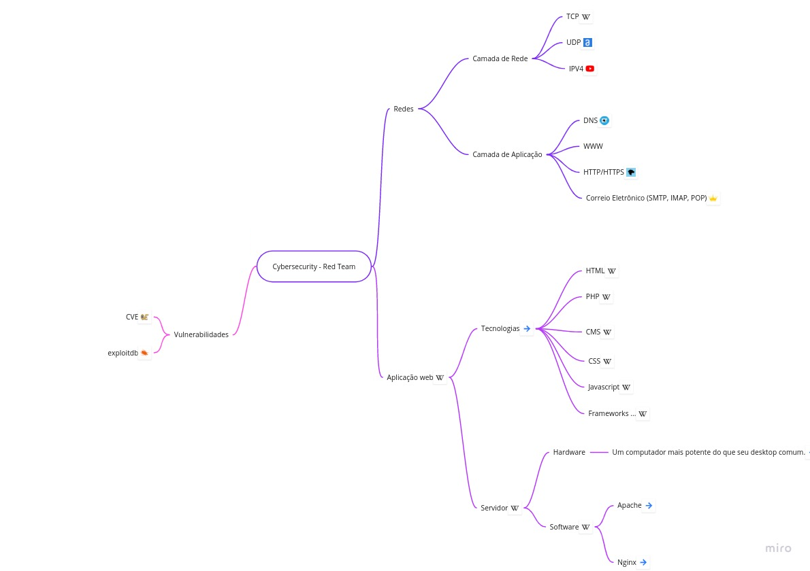

# CyberSecurity

## Roadmap

# [OSI](osi.md)

## Redes

é um conjunto de dois ou mais dispositivos eletrônicos de computação interligados por um sistema de comunicação digital, guiados por um conjunto de regras (protocolo de rede) para compartilhar entre si informação, serviços e, recursos físicos e lógicos.

- [Camada de Rede](rede.md)

- [Camada de Aplicação](aplicacao.md)

## Servidor

Em informática, um servidor é um software ou computador, com sistema de computação centralizada que fornece serviços a uma rede de computadores, chamada de cliente.

- [Hardware](hardware.md)

- [Software](software.md)

## Aprendendo novas tecnologias

- [Cursos gratuitos](cursos.md)

## Vulnerabilidades

### Como se informar sobre vulnerabilidades já descobertas por pesquisadores ?

- [O que é CVE](cve.md)

- [O que é exploit](exploit.md)

# Algumas falhas comuns

- [Information disclosure](infoDisclosure.md)
- [Business logic vulnerabilities](businessLogic.md)
- [Cross-site scripting](xss.md)
- [SQL injection](sqli.md)
